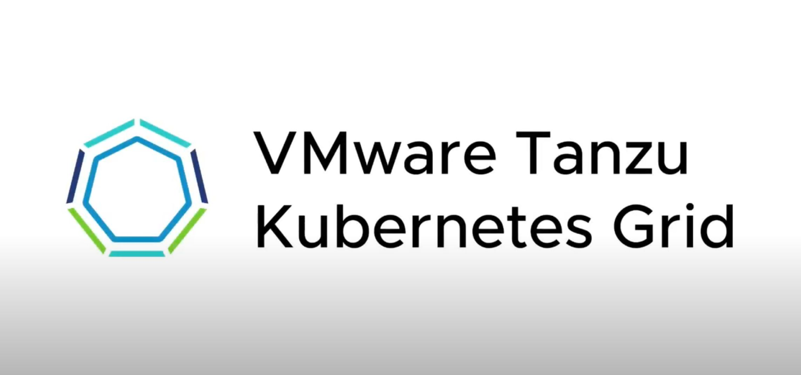
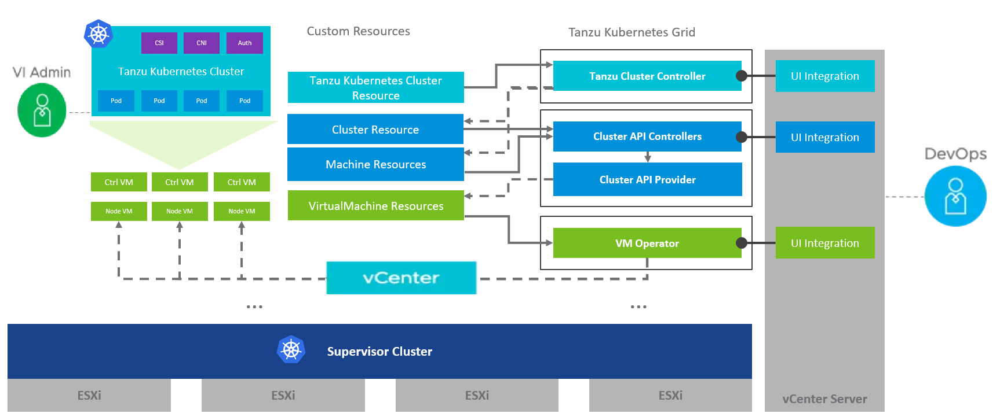
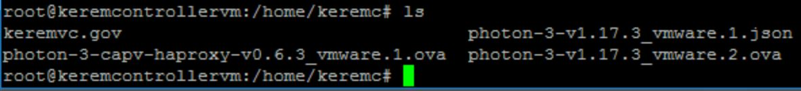
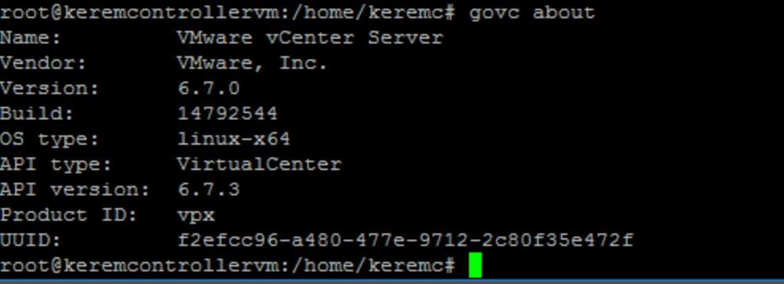
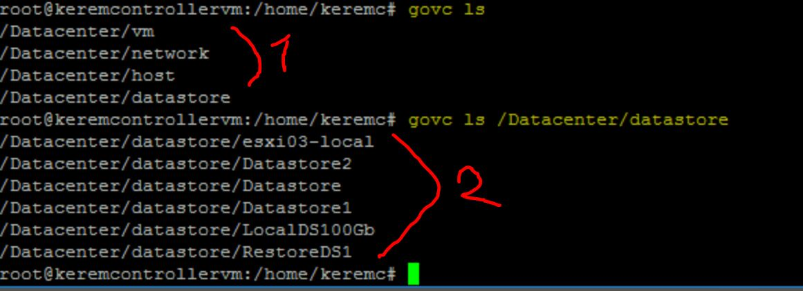
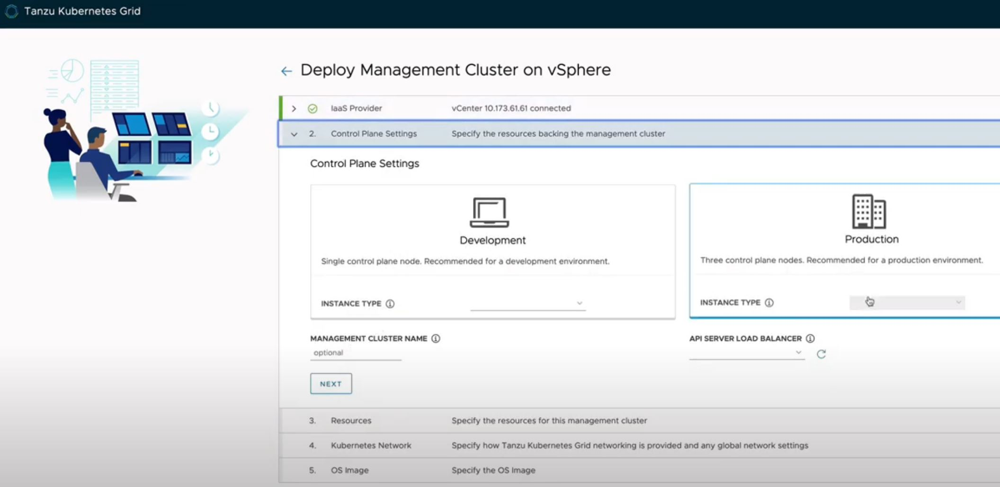
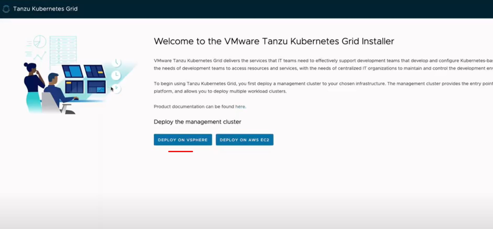
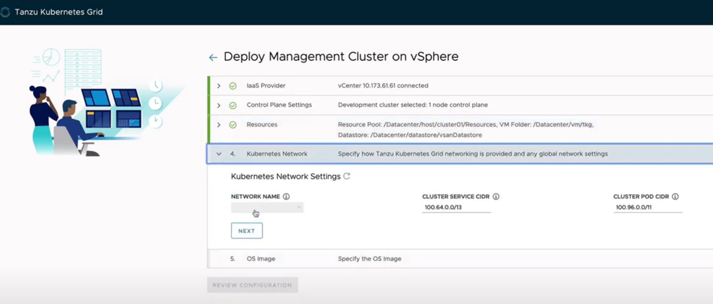
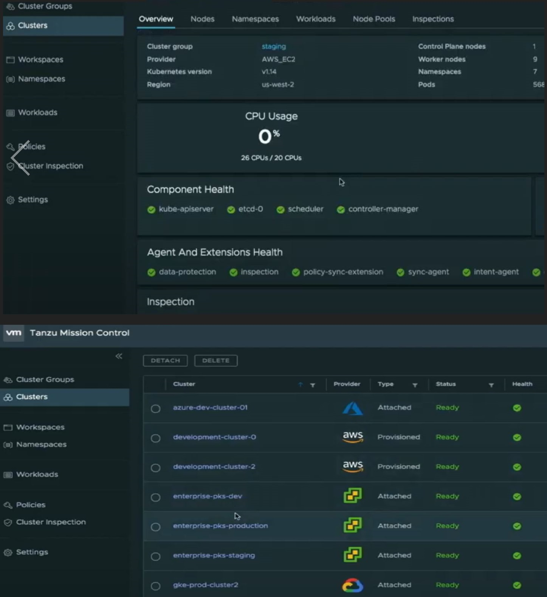

# Quick Deployment VMware Tanzu Kubernetes Grid using Docker Container !
*Written by Kerem ÇELİKER*
- Twitter: **`@CloudRss`**
- Linkedin: **`linkedin.com/in/keremceliker`**
- Blog: **`www.keremceliker.com`**


1. **Where do you start ?**
2. **Build a cluster from scratch and How hard is it to repeat ?**
3. **It still easily manageable and scalable ?**
4. **Ready to build an applications with velocity to run in a Cloud-Native Environment ?**

In this article, I will show and provide you all the follows answers above also ll introduce "how to start & install easily "VMware Tanzu Kubernetes Grid (Pivotal) and Integrate into VMware ESXi Infrastructure on Kubernetes with a technical overview on automated multi-cluster operations"

The vSphere 7 with Kubernetes and Tanzu Kubernetes Grid, which VMware has built into VCF 4.0(VMware Cloud Foundation), were introduced in mid-April 2020 in accordance with vSphere 6.7, vSphere 7. It provides the Kubernetes environment, which PKS provides at a main level, to manage the vSphere with Kubernetes very easily centrally from within vCenter. Also VCF 4.0 and vSphere 7 can be built-in vCenter 7 where vSphere with Kubernetes. 

The most important thing is DevOps & DevCloud teams can create their Kubernetes clusters and work on their Kubernetes clusters through the CLI isolated from vCenter with the authority they want to have..

TKG offers automatic Kubernetes K8s installation to provide a consistent experience to different clouds (Amazon AWS Cloud and vSphere) using Cluster API.


  
  
  

## Pre-Requisites

1.1) **Introductions:**

- Ubuntu or RedHat Linux Server (I prefer to have it but you can go on Windows10 if you wonder)
- VMware Tanzu "TKG-CLI" will be installed
- Govc CLI needs to be configured it.
- KubeCtl always have to be installed.
- Docker Container version 18.09 must be installed in your Linux or Windows build
	*As part of the TKG Cli deployment, it creates a OnPrem Kubernetes Cluster on the VMware Guest and uses it to attach the boot-strap to the target Tanzu Kubernete Grid.
- VMware vSphere ESXi 6.7
- Python3 Tool
- Putty
- PuttyGen


1.2) **Links for Pre-Requisites:**

  -	Install latest version of  [Tanzu Kubernetes Grid CLI Tool and OVA Files](https://my.vmware.com/group/vmware/info/slug/infrastructure_operations_management/vmware_tanzu_kubernetes_grid/1_x)
  -	Install latest version of [VMware vSphere ESXi 7](https://www.vmware.com/go/download-vsphere)
  -	Install latest version of  [Docker CE](https://docs.docker.com/install/linux/docker-ce/)
  - Install latest version of [Govc Tool for VMware Tasks](https://github.com/vmware/govmomi/releases)
  - Install latest version of Kubernetes [KubeCtl - Kubernetes CLI](https://kubernetes.io/docs/tasks/tools/install-kubectl/)


## Infrastructure Diagram on VMware Tanzu Kubernetes Grid using Docker for DevOps and Cloud Processes




## Instructions on VMware Tanzu Kubernetes Grid using Kubernetes & Pivotal Concepts

1- **The following needs to be Have and Downloaded:**
```
Photon v3 Kubernetes v1.17.3 OVA File for Linux
**********
Photon v3 Capv Haproxy v0.6.3 OVA File for Linux
```

  
  
  

2- **Install Govc for Linux :**
```
wget https://github.com/vmware/govmomi/releases/download/v0.22.1/vc_linux_amd64.gz
root@keremcontrollervm:/home/keremc# gzip -d govc_linux_amd64.gz
root@keremcontrollervm:/home/keremc# chmod +x govc_linux_amd64
root@keremcontrollervm:/home/keremc# mv govc_linux_amd64 /usr/local/bin/govc
```
 

  

3- **Install Tanzu TKG Tool for Linux :**
```
wget https://github.com/vmware/govmomi/releases/download/tkg-linux-amd64-v1.0.0_vmware.1.gz

**Follow the above same-steps as Govc
```

4- **Create Docker Container on Your Linux VM for the Tanzu TKG installation on the vCenter vSphere for Boot-Strap Process;**
```
$ sudo apt-get update
$ sudo apt-get install docker-ce docker-ce-cli containerd.io
$ apt-cache madison docker-ce
$ sudo apt-get install docker-ce=<VERSION_STRING> docker-ce-cli=<VERSION_STRING> containerd.io (Choose 5.18 or 5.19, It's up to you)
$ sudo docker run hello-world (for Verify to correctly running Docker Contaianer Services)
```
```
root@keremcontrollervm:/home/keremc# sudo apt-get install docker-ce=5:18.09.9~3-0~ubuntu-bionic dockerd.io
Reading package lists... Done
Building dependency tree
Reading state information... Done
containerd.io is already the newest version (1.2.13-1).
The following packages will be DOWNGRADED:
  docker-ce docker-ce-cli
0 upgraded, 0 newly installed, 2 downgraded, 0 to remove and 244 not upgraded.
Need to get 34.7 MB of archives.
After this operation, 122 MB disk space will be freed.
Do you want to continue? [Y/n] Y
Get:1 https://download.docker.com/linux/ubuntu bionic/stable amd64 docker-ce-cli amd64 5:18.09.9~3-0~u
Get:2 https://download.docker.com/linux/ubuntu bionic/stable amd64 docker-ce amd64 5:18.09.9~3-0~ubunt
Fetched 34.7 MB in 5s (7,603 kB/s)
dpkg: warning: downgrading docker-ce-cli from 5:19.03.8~3-0~ubuntu-bionic to 5:18.09.9~3-0~ubuntu-bion
(Reading database ... 66851 files and directories currently installed.)
Preparing to unpack .../docker-ce-cli_5%3a18.09.9~3-0~ubuntu-bionic_amd64.deb ...
Unpacking docker-ce-cli (5:18.09.9~3-0~ubuntu-bionic) over (5:19.03.8~3-0~ubuntu-bionic) ...
dpkg: warning: downgrading docker-ce from 5:19.03.8~3-0~ubuntu-bionic to 5:18.09.9~3-0~ubuntu-bionic
Preparing to unpack .../docker-ce_5%3a18.09.9~3-0~ubuntu-bionic_amd64.deb ...
Unpacking docker-ce (5:18.09.9~3-0~ubuntu-bionic) over (5:19.03.8~3-0~ubuntu-bionic) ...
Processing triggers for ureadahead (0.100.0-20) ...
Processing triggers for systemd (237-3ubuntu10) ...
Processing triggers for man-db (2.8.3-2) ...
Setting up docker-ce-cli (5:18.09.9~3-0~ubuntu-bionic) ...
Setting up docker-ce (5:18.09.9~3-0~ubuntu-bionic) ...
update-alternatives: using /usr/bin/dockerd-ce to provide /usr/bin/dockerd (dockerd) in auto mode
```

```
root@keremcontrollervm:/home/keremc# sudo docker run hello-world
Unable to find image 'hello-world:latest' locally
latest: Pulling from library/hello-world
0e03bdcc26d7: Pull complete
Digest: sha256:8e3114318a995a1ee497790535e7b88365222a21771ae7e53687ad76563e8e76
Status: Downloaded newer image for hello-world:latest

Hello from Docker!!!!

This message shows that your installation appears to be working correctly !!
```

5- **Create a Blank-Text with .Json script file**

```
root@keremcontrollervm:/home/keremc# cat keremvc.gov
export GOVC_URL=https://192.168.1.3
export GOVC_USERNAME=administrator@vsphere.local
export GOVC_PASSWORD=KeremCeliker2020-!
export GOVC_INSECURE=true
export GOVC_DATASTORE=/Datacenter/datastore/K8sForNAS
export GOVC_RESOURCE_POOL='*/Resources'
export GOVC_DATACENTER=Datacenter
```

6- **Let's make pre-setup to connect to VMware vCenter and create Json script on it:**
```
 govc import.spec photon-3-v1.17.3_vmware.2.ova | jq '.Name="photon-3-v1.17.3_vmware.2"' | jq '.Name="photo0].Network="VM-Network"' > photon-3-v1.17.3_vmware.1.json
```


7- **Import the Photon OVA file to vCenter by JSON script;**
```
govc import.ova -options=photon-3-v1.17.3_vmware.1.json photon-3-v1.17.3_vmware.2.ova
```

8- **Must be also complete on Proxy OVA File with the same-step;**


Don't forget do tag follows below as OVA template with GOVC CLI
```
govc vm.markastemplate photon-3-v1.17.3
govc vm.markastemplate photon-3-capv-haproxy-v0.6.3
```

9- **Extract Tanzu TKG CLI file move to under path /usr/loca/bin/**
```
mv tkg-linux-amd64-v1.0.0_vmware.1 /usr/local/bin/tkg
```

10- **Use SSH connection with the following tunneling by Putty to start a Tanzu Kubernetes GUI for Browser**
```
tkg init --ui
```

11- **And now You are ready to Install VMware Tanzu Kubernetes Grid Page from Chrome/FireFox**
```
http://127.0.0.1/#/ui
```


  


12- **Go with Step by Step Deploy Management Cluster on vSphere;**

  


- Set your IaaS Provider Informations as SSH Key,Username-Password.

- Select and Input your `Control-Plane, Instance Type` as Development or Prod, `MGMT Cluster Name and Load-Balancer API` Server
   
   *Just skip Production Section for now :-) Ha-Proxy OVA template that will do as the load balancer for management plane on Kubernetes.
   
     
	

- Consider your VM-Resources Pool as Pool-Name with Path and Folder/DataStore

- Make sure Kubernetes run in the correct `Network VXLAN and Adapter as Pod/Worker` Nodes

  
  

- Choose your specify the OS Template or ISO (You can quick-skip it this step with Next)

13- **Please Review your all Tanzu & Kubernetes Configurations and `Deploy & Enjoy !` :)**


14- **Let's Show and Check Tanzu Kubernetes Cluster in VMware vSphere**
```
tkg get management-cluster
kubectl get nodes
```

- If you have no any Tanzu Kubernetes Cluster as Worker Machine after step 12, just follow the command below for `Troubleshoot`;
```
tkg create cluster MyFirstTanzuCluster --plan=DevOps --worker-machine-count=4
```
  
15-**As Straight-Forward we will create a cool small Hello-World page on the VMware Tanzu K8s Grid for Test.**
```
tkg create cluster Hello-Tanzu-From-Kerem --plan prod --kubernetes-version v1.18.3_vmware.2 --controlplane-machine-count 1 --worker-machine-count 1
```

- Let's take a short-look what's going on Kubernetes Cluster Inside.
```
kubectl get nodes && kubectl config get-contexts
tkg get cluster
```

```
NAME                                                STATUS    ROLES    AGE     VERSION
Hello-Tanzu-From-Kerem   			     Ready    master   18h   v1.18+vmware.1
Hello-Tanzu-From-Kerem-md-0-87y3t6p011-u2gbz         Ready    <none>   18h   v1.18+vmware.1
Hello-Tanzu-From-Kerem-md-0-87y3t6p011-hka5o         Ready    <none>   18h   v1.18+vmware.1
Hello-Tanzu-From-Kerem-md-0-87y3t6p011-km7rx         Ready    <none>   18h   v1.18+vmware.1
```

## Result

Now both DevOps and SysOps Teams will be able to work together through the same single clustered-stack and easily provide Multi-API - Multi-Cloud integrations from an interface

It looks Cool and Fun for sure, doesn't it ? :-)

  


## References

https://tanzu.vmware.com/

https://tanzu.vmware.com/kubernetes-grid

https://m.youtube.com/watch?v=BukxNlznftI


  
